# skyland-auto-sign

明日方舟森空岛一键签到脚本，基于python

有三种方法部署
> 1.自己手动在电脑上运行（不想挂载在服务器上的用户推荐这个，因为可以配合MAA一键签到）
>
> 2.在云函数上部署（推荐，省时省力，不用装环境，几乎不用管）
>
> 3.使用Github Actions托管（相比云函数来讲非常推荐，因为有日志会存储，而且也免费）
>
> 4.使用家用NAS面板部署
>

## 快速导航

- [在自己电脑上运行](#mode1)
    - [配合MAA运行](#maa)
- [在云函数上运行](#mode2)
  -- [使用手机进行操作](#mobile)
- [使用Github Actions托管](#mode3)
- [使用家用NAS](#mode4)
- [多账号支持](#multiple_account)
- [多端登录问题](#multiple_login)
- [有关新版本参数验证](#sign-header)

[视频用法]( https://www.bilibili.com/video/BV1DP411h7s6)

<a name="mode1"></a>

## 方法1

1.先装python（3.6及以上）且安装requests库.cmd 运行`pip install requests`

2.下载脚本`skyland.py`

3.双击本文件（弹出一个黑框框代表你成功了）
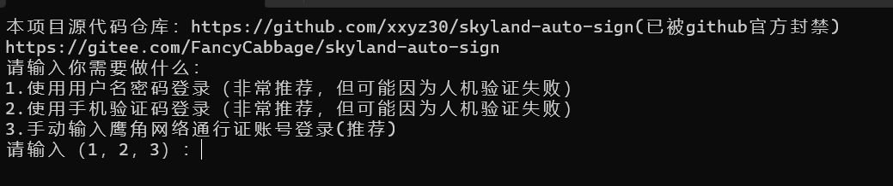

（以上3步可以用我打好的exe文件直接运行，链接见[release](https://gitee.com/FancyCabbage/skyland-auto-sign/releases)

4.本软件有3种模式：

第一个模式和第二个模式不多说了，填入你的信息即可。

就是注意一下输入的密码是不会显示的，但实际是有的，这点需要注意一下！

如果第一种模式和第二种模式你都没法过人机验证的话，可以使用第三种模式：

登录电脑的森空岛[官网](https://www.skland.com/)
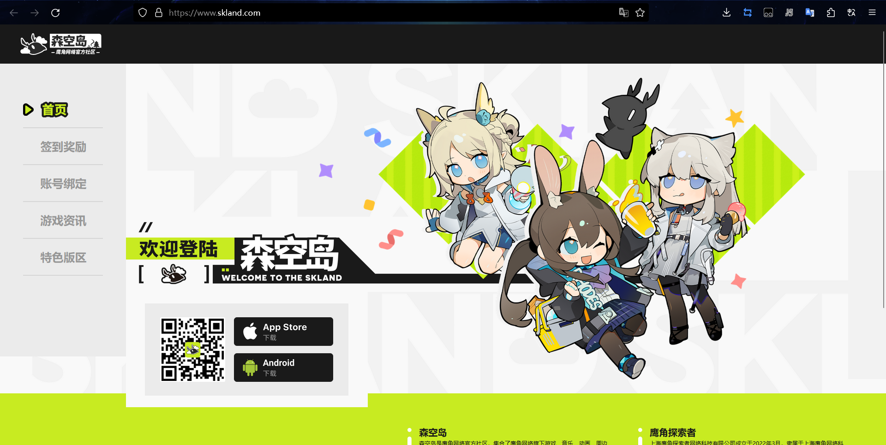

登录完成后，访问[这个网址](https://web-api.skland.com/account/info/hg) 。然后复制这里的所有内容，粘贴进去即可。
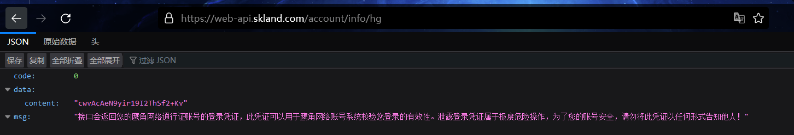
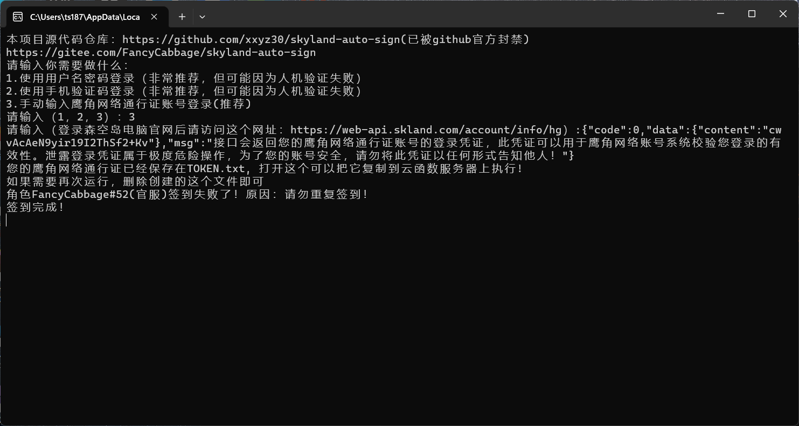

最后再次启动的时候，脚本就不会再询问你是否添加账号了，而是直接帮你签到了

<a name="maa"></a>

### MAA支持

可以使用MAA自动执行脚本

MAA在连接设置里有运行前脚本，输入`skyland.py`的路径后，每次连接模拟器时会自动帮你签到。

如果你用的exe版本的，请输入`skyland.exe`的路径！
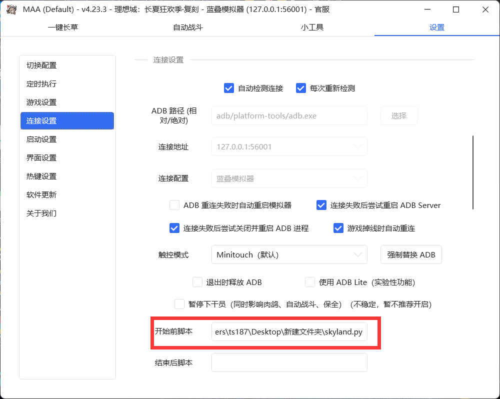

第一次执行的话应该还是会出现这个东西
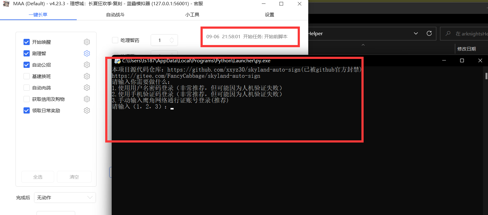

设置完毕后直接应该会执行完成，以后都会这样


TOKEN和日志应该都会被存储在MAA根路径下
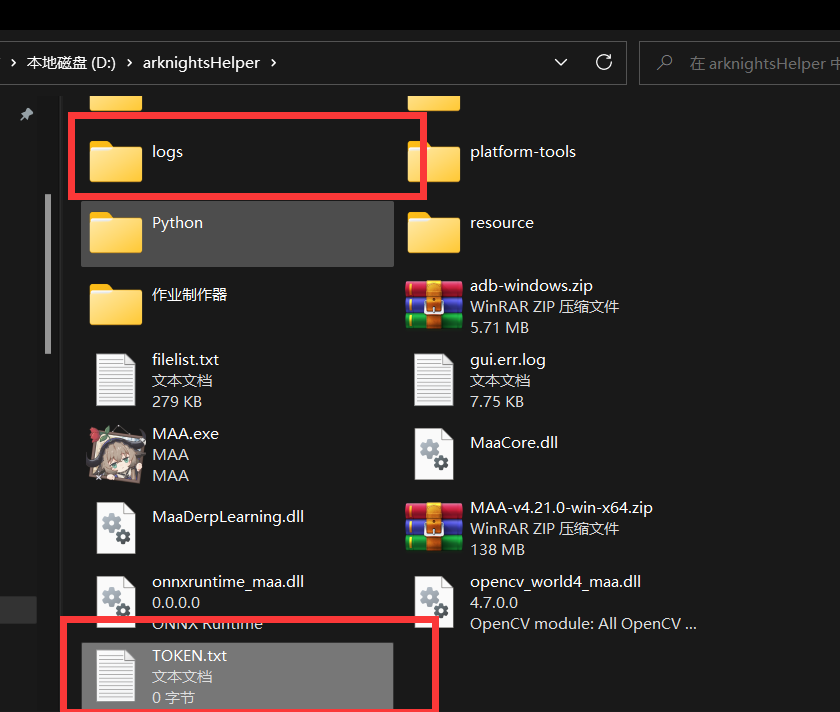

<a name="mode2"></a>

## 方法2

使用华为云挂载服务器签到（华为云有每月免费额度）

在`cloud_functions`文件夹下的代码是华为云的适配好的代码。

1.首先注册登录华为云账号
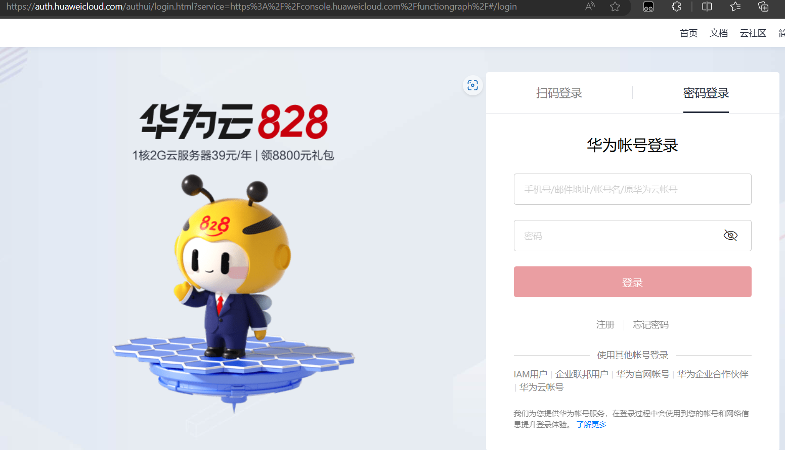

2.注册且登录完成后，进入[这个网址](https://console.huaweicloud.com/functiongraph)

3.进入后可能要求你实名认证，实名认证一下即可。

4.完成后点击右上角的'创建函数'按钮
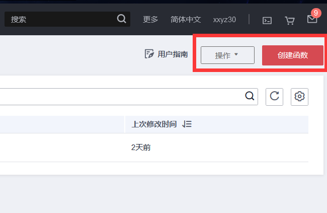

5.进入选择运行时环境为`Python 3.10`， 并填一下脚本名称（随便填）。其它设置不用动
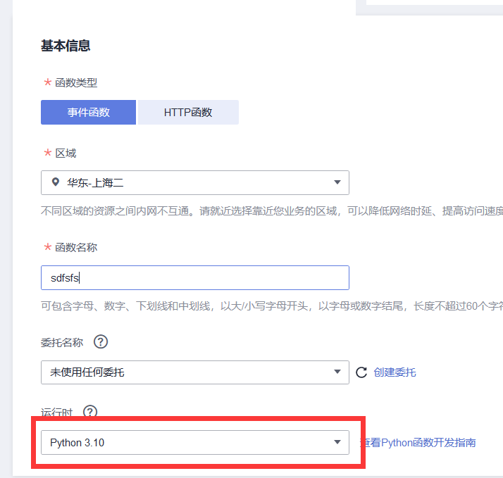

6.进来后是这样的界面，点击右上角上传自zip文件（或者你在左边的编辑器里自己把文件一个个创建好复制粘贴进去也行）
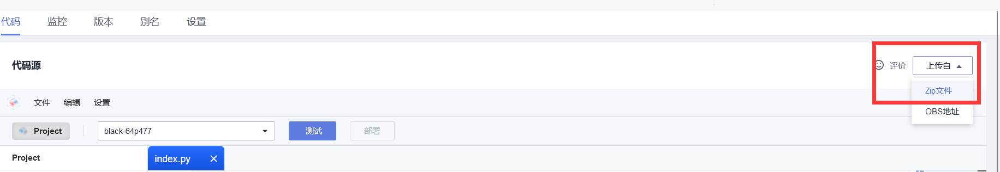

7.上传
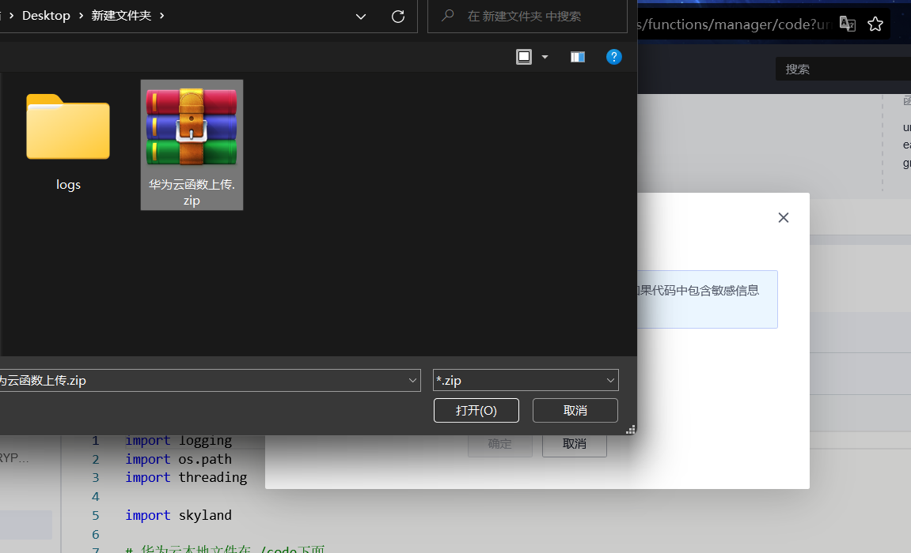

8.上传完成后应该是这个样子的
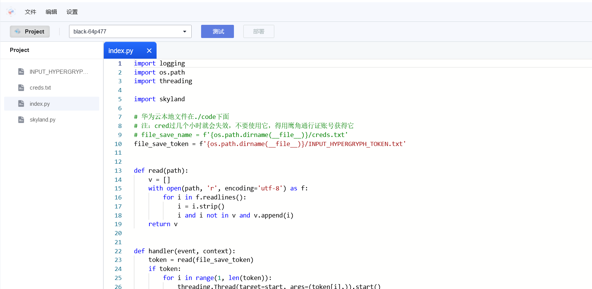

9.选中`INPUT_HYPERGRYPH_TOKEN.txt`，在右边添加你的鹰角通行证.支持多个，换行添加下一个即可。
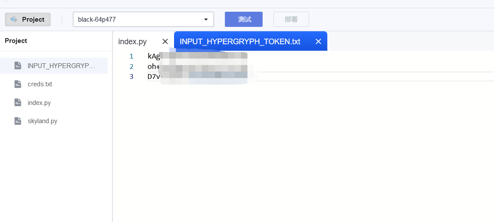

10.保存完毕后，可以点击测试测试一下脚本。创建测试这里直接点击创建即可
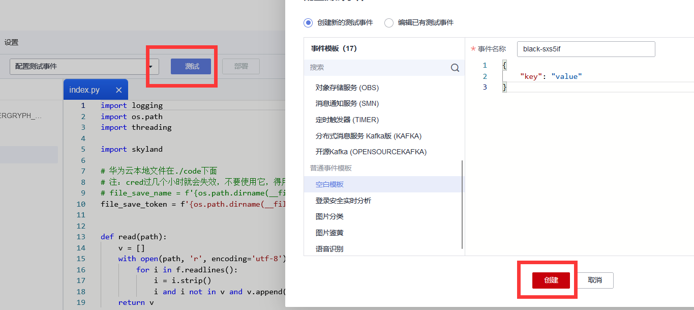

11.正常结束后是这个样子的（记得保存和部署）：
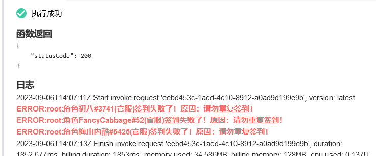

12.为了让脚本每天执行，我们需要创建一个触发器
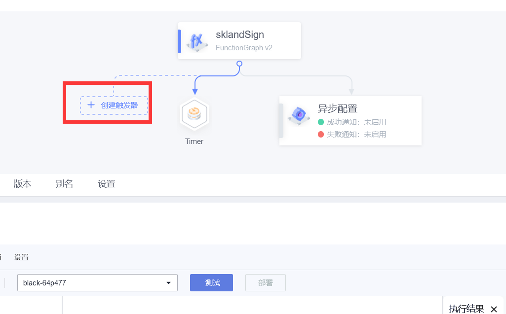

触发器类型请选择`定时触发器`
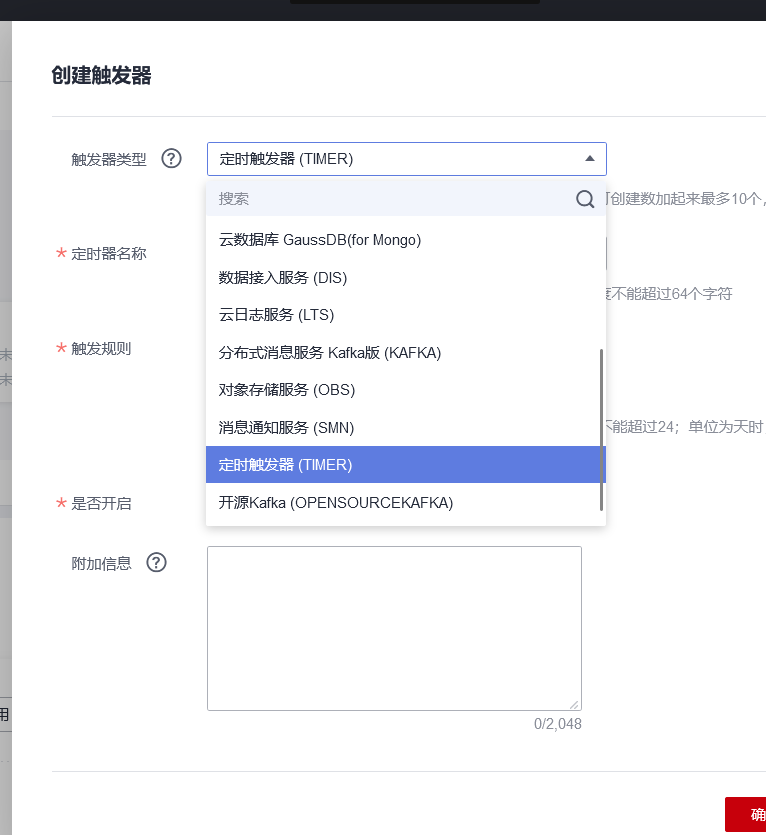

触发器类型选择`Cron表达式`
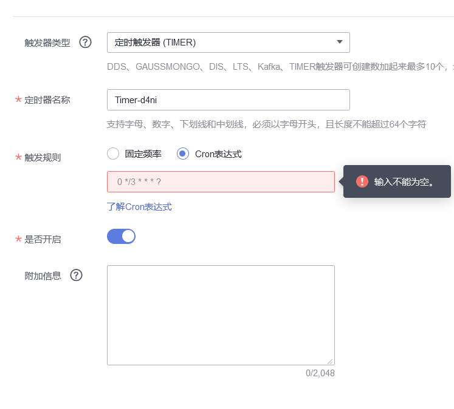

然后填入这串东西`0 1 1 * * ?`
它指的是每天凌晨1点01分会执行一次
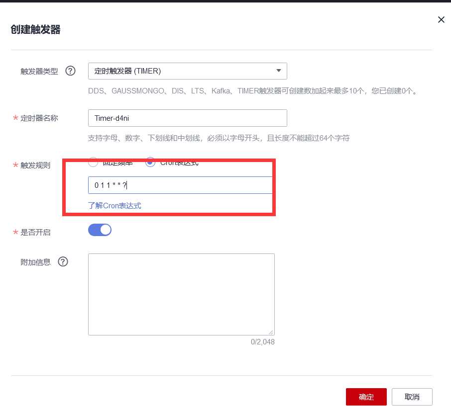

然后确定保存即可

最后大功告成，等着每天发奖励即可！

注意：如果森空岛登录失效，则可能需要重新配置你的鹰角网络通行证！

<a name="mobile"></a>

### 使用手机操作

//TODO

<a name="mode3"></a>

## 方法3

使用Github Action自动运行脚本

本方法需要你有一定的git使用经验

首先确认自己的github处于登录状态，然后自己新建一个仓库

将本仓库的源代码全部下载下来，上传到github

进入自己仓库的项目主页后，在上方的菜单中进入Settings > Secrets and variables > Actions

点击 New repository secret

创建名为`TOKEN`的环境变量（注意变量名全大写），并填入你的鹰角网络通行证，如果要管理多个账号，换行即可

如果是第一次使用GitHub Action的话，还需要手动打开这个功能 在你仓库上方菜单中进入Actions

点击 I understand... enable them > Enable workflow

之后就可以自动运行签到了, 想要手动测试的话，选择左侧的Auto Sign > Run workflow, 刷新页面就能看到结果了

<a name="mode3"></a>

## 使用NAS部署

其实和Github Action的配置方式一样，导入脚本以后，创建一个`TOKEN`的环境变量即可。

每个面板可能创建方式不太一样，不展示了

<a name="multiple_account"></a>

## 多账号支持

软件支持多个账号添加，在文件里换行即可

//todo

### 使用浏览器登录多个账号获得TOKEN时要注意的问题

**不要去登出账号，否则鹰角网络通行证会失效！**

如果要添加多个账号，请删除浏览器缓存。或者使用浏览器自带的隐私浏览模式，拿到Token后，关闭隐私窗口，再登录一次即可！
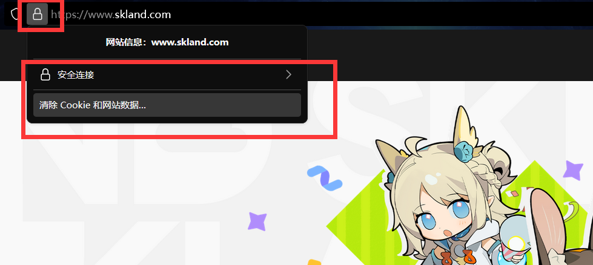
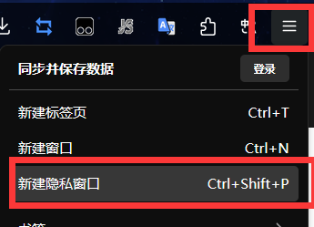

<a name="multiple_account"></a>

## 多端登录的问题

同一账号多端登录是没问题的，但是要注意一点就是电脑在用密码登录后，手机客户端有可能会被挤掉

最后就是别手贱去点客户端里的清理会话，因为那样子会把所有的登录状态清空

## sign-header

新版本森空岛添加了参数验证，有两个方法可以绕过，推荐第一种方法

1.森空岛签名请求头算法：

接口地址（不包括网址） + 如果是GET则使用网址问号后面的参数。如果是POST则使用body的json的字符串 + 时间戳 +
请求头的四个重要参数(`platform`,`timestamp`,`dId`和`vName`).toJSON()

将此字符串做HMAC加密，算法为SHA-256，密钥为请求cred接口会返回的一个token

再将加密后的字符串做MD5即得到签名

例子：

```text
    
    拼接的字符串：
    /api/v1/game/player/binding1695184599{"platform":"","timestamp":"1695184599","dId":"","vName":""}
    将其做hmac-sha256
    6b0516d1325dea1207e03f6840cd0c15ef2f55959c3d0ed2f18d99102a9cc7f5
    再做md5
    92229bf3c18c476e77bcd70c2bd997d3
    最后就是sign的头了
    
```

注意：

请求头四个值`platform`,`timestamp`,`dId`和`vName`必传，然后注意一下字符串顺序，四个值必须按照这样的顺序拼接

其中`platform`,`dId`和`vName`里面的值随便填

`timestamp`为时间戳，以秒为单位
不过`timestamp`因为精度问题容易造成服务器响应`请勿修改设备时间`，此时把这个时间戳稍微减少几秒就行


2.使用旧版本森空岛请求头，防止验参

```text
'User-Agent': 'Skland/1.0.1 (com.hypergryph.skland; build': '100001014; Android 31; ) Okhttp/4.11.0',
'vCode': '100001014',
'vName': '1.0.1',
'dId': 'de9759a5afaa634f',
'platform': '1'
```